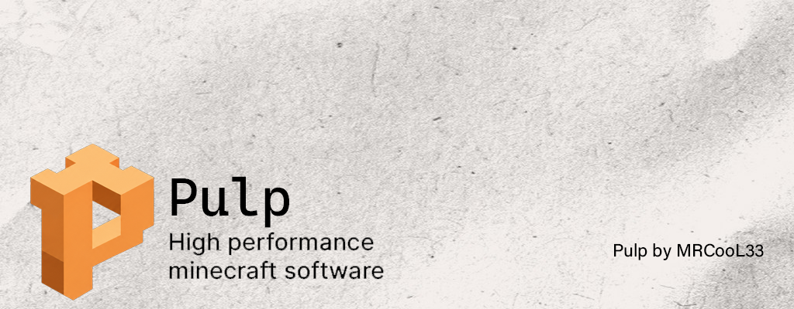

<div align="center">

[](https://github.com/MRCooL33/Pulp-mc/actions)⠀
[](https://github.com/MRCooL33/Pulp-mc/releases)

**Pulp** is a [Leaf](https://github.com/Winds-Studio/Leaf) fork designed to be customizable and high-performance.
</div>

> [!WARNING]
> Pulp is a performance-oriented fork. Make sure to take backups **before** switching to it. Everyone is welcome to contribute optimizations or report issues to help us improve.

## 🗞️ Features
- **Based on [Leaf](https://github.com/Winds-Studio/Leaf)** (itself a [Paper](https://papermc.io/) fork) for generic performance and flexible API
- **Async** pathfinding, mob spawning and entity tracker
- **Various optimizations** blending from [other forks](#-credits) and our own
- **Fully compatible** with Spigot and Paper plugins
- **Latest dependencies**, keeping all dependencies up-to-date
- **Allows all characters in usernames**, including Chinese and other characters
- **Fixes** some Minecraft bugs
- **Mod Protocols** support
- **More customized** relying on features of [Purpur](https://github.com/PurpurMC/Purpur)
- **Linear region file format**, to save disk space
- **Maintenance friendly**, integrating with [Sentry](https://sentry.io/welcome/) of [Pufferfish](https://github.com/pufferfish-gg/Pufferfish) to easily track all errors coming from your server in extreme detail
- And more...

## 📥 Download
Get the latest build from [GitHub Releases](https://github.com/MRCooL33/Pulp-mc/releases).

## 📦 Building
Building a Paperclip JAR for distribution:
```bash
./gradlew applyAllPatches && ./gradlew createPaperclipJar
```

## ⚖️ License
Pulp is licensed under various open source licenses inherited from its upstream projects (Leaf, Paper, Spigot, CraftBukkit, and others). See [LICENSE.md](LICENSE.md) for full details.

## 📜 Credits
Pulp is a fork of [Leaf](https://github.com/Winds-Studio/Leaf), and includes patches originally taken from the projects below.<br>
If these excellent projects hadn't existed, Pulp wouldn't have become great.

- [Leaf](https://github.com/Winds-Studio/Leaf) (direct upstream)
- [Gale](https://github.com/Dreeam-qwq/Gale) ([Original Repo](https://github.com/GaleMC/Gale))
- [Pufferfish](https://github.com/pufferfish-gg/Pufferfish)
- [Purpur](https://github.com/PurpurMC/Purpur)
- <details>
    <summary>🍴 Expand to see forks that Leaf (and by extension Pulp) takes patches from.</summary>
    <p>
      • <a href="https://github.com/KeYiMC/KeYi">KeYi</a> (R.I.P.)
        <a href="https://github.com/MikuMC/KeYiBackup">(Backup)</a><br>
      • <a href="https://github.com/etil2jz/Mirai">Mirai</a><br>
      • <a href="https://github.com/Bloom-host/Petal">Petal</a><br>
      • <a href="https://github.com/fxmorin/carpet-fixes">Carpet Fixes</a><br>
      • <a href="https://github.com/Akarin-project/Akarin">Akarin</a><br>
      • <a href="https://github.com/Cryptite/Slice">Slice</a><br>
      • <a href="https://github.com/ProjectEdenGG/Parchment">Parchment</a><br>
      • <a href="https://github.com/LeavesMC/Leaves">Leaves</a><br>
      • <a href="https://github.com/KaiijuMC/Kaiiju">Kaiiju</a><br>
      • <a href="https://github.com/PlazmaMC/PlazmaBukkit">Plazma</a><br>
      • <a href="https://github.com/SparklyPower/SparklyPaper">SparklyPaper</a><br>
      • <a href="https://github.com/HaHaWTH/Polpot">Polpot</a><br>
      • <a href="https://github.com/plasmoapp/matter">Matter</a><br>
      • <a href="https://github.com/LuminolMC/Luminol">Luminol</a><br>
      • <a href="https://github.com/Gensokyo-Reimagined/Nitori">Nitori</a><br>
      • <a href="https://github.com/Tuinity/Moonrise">Moonrise</a> (during 1.21.1)<br>
      • <a href="https://github.com/Samsuik/Sakura">Sakura</a><br>
    </p>
</details>
